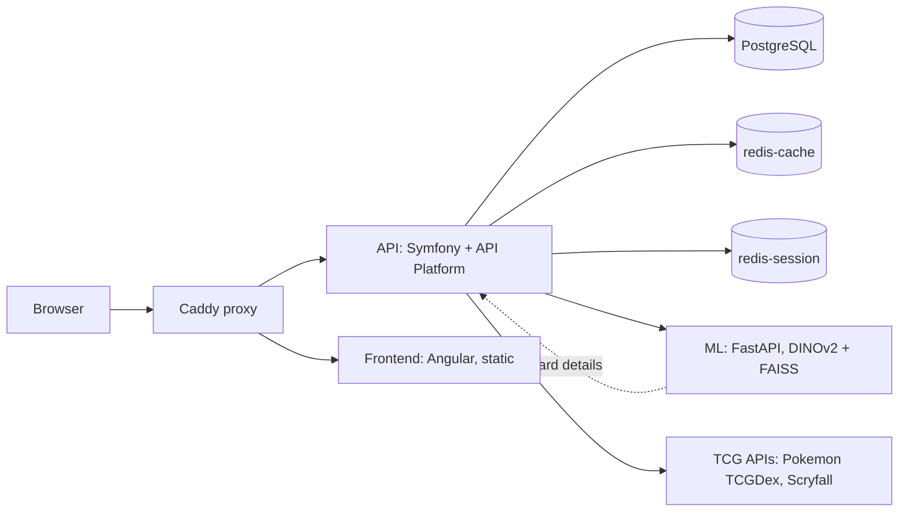

# Architecture overview

## System

- Card Vault is a monorepo with four deployable pieces orchestrated by Docker
  Compose.
- The frontend only talks to the API.\
  The API talks to the ML service, the TCG APIs, PostgreSQL and the two Redis
  instances.
- The ML service calls the API back to enrich its matches with card details.

## Layers

| Layer    | Home                       | Role                                                  |
|----------|----------------------------|-------------------------------------------------------|
| API      | [backend.md](backend.md)   | REST API, auth, vault domain, integration hub         |
| Frontend | [frontend.md](frontend.md) | SPA, standalone components, lazy-loaded routes        |
| ML       | [ml.md](ml.md)             | card recognition by image similarity (DINOv2 + FAISS) |
| Proxy    | [proxy.md](proxy.md)       | auto-HTTPS, routing, security headers                 |
