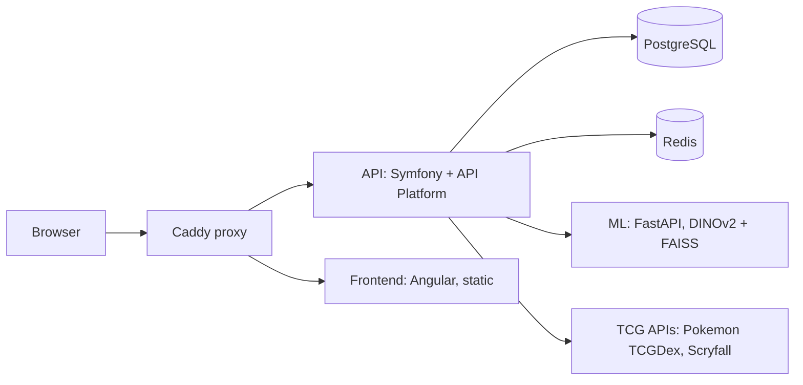

# Architecture overview

## System

Card Vault is a monorepo with four deployable pieces orchestrated by Docker
Compose
The frontend talks only to the API, the API talks to the ML service,
the TCG APIs, and PostgreSQL/Redis.

## Layers

| Layer    | Home                       | Role                                               |
|----------|----------------------------|----------------------------------------------------|
| API      | [backend.md](backend.md)   | REST API, auth, collection domain, integration hub |
| Frontend | [frontend.md](frontend.md) | SPA, feature modules, lazy-loaded routes           |
| ML       | [ml.md](ml.md)             | card image classification via DINOv2 + FAISS       |
| Proxy    | [proxy.md](proxy.md)       | auto-HTTPS, static serving, reverse proxy          |
