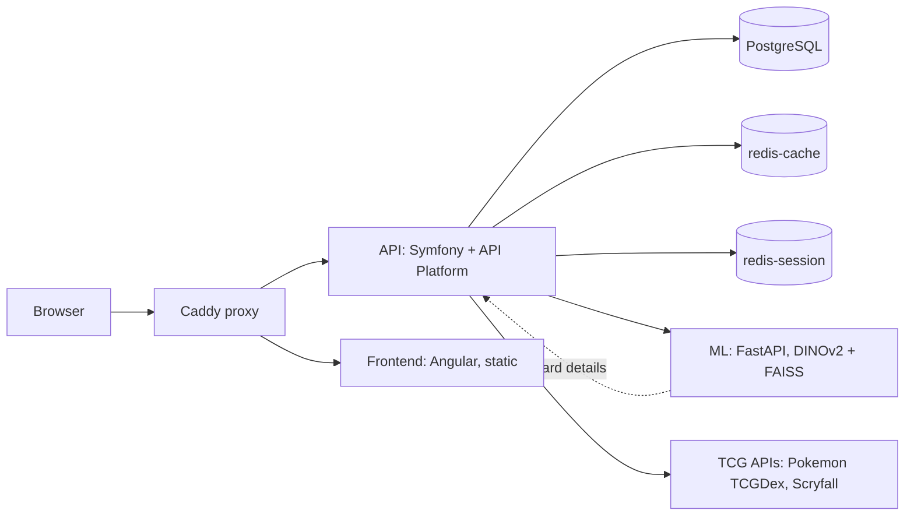

# Architecture overview

## System

- Card Vault is a monorepo with four deployable pieces orchestrated by Docker
  Compose.
- The frontend only talks to the API.\
  The API talks to the ML service, the TCG APIs, PostgreSQL and the two Redis
  instances.
- The ML service calls the API back to enrich its matches with card details.

```mermaid
flowchart LR
    User[Browser] --> Caddy[Caddy proxy]
    Caddy --> API[API: Symfony + API Platform]
    Caddy --> FE[Frontend: Angular, static]
    API --> PG[(PostgreSQL)]
    API --> RC[(redis-cache)]
    API --> RS[(redis-session)]
    API --> ML[ML: FastAPI, DINOv2 + FAISS]
    ML -. card details .-> API
    API --> TCG[TCG APIs: Pokemon TCGDex, Scryfall]
```

## Layers

| Layer    | Home                       | Role                                                  |
|----------|----------------------------|-------------------------------------------------------|
| API      | [backend.md](backend.md)   | REST API, auth, vault domain, integration hub         |
| Frontend | [frontend.md](frontend.md) | SPA, standalone components, lazy-loaded routes        |
| ML       | [ml.md](ml.md)             | card recognition by image similarity (DINOv2 + FAISS) |
| Proxy    | [proxy.md](proxy.md)       | auto-HTTPS, routing, security headers                 |

## Stack

### Backend

Tests and checks:

### Frontend

Tests and checks:

### Machine learning

Tests and checks:

### Data

### Hosting and network

### Observability and analytics

### Tooling and CI

Checks:

